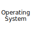

## Hi there 👋, I am ...

📖 An undergraduate,

⚙️ Studying in School of Mechatronics Engineering and Automation,

🇨🇳 Harbin Institute of Technology (Shenzhen),

🤖 Majoring in Automation.

## How to reach me?

😃 Personal Email: chenx_dust@outlook.com (Recommended)

🧑🏻‍💻 Formal Email: chen.xijun@outlook.com

🌐 Website Email: me@chenx.online i@cx0.cc

✈️ Telegram: [@cast_dust](https://t.me/cast_dust)

## More about me?

I'm interested in ...

👾 Cool Technology

📶 Network and Hosting

📺 Kawaii Anime

🎵 Old-fasion Music

🌏 World Concerns

🗯️ Great Thoughts

## What about my skills?

<table>
    <tbody><tr>
        <td></td>
        <td><strong>C++:</strong></td>
        <td>Practiced, especially modern C++ (14~20).</td>
    </tr><tr>
        <td></td>
        <td><strong>Python:</strong></td>
        <td>Practiced and familiar.</td>
    </tr><tr>
        <td></td>
        <td><strong>Rust:</strong></td>
        <td>Learning...</td>
    </tr><tr>
        <td></td>
        <td><strong>C#:</strong></td>
        <td>Learning...</td>
    </tr><tr>
        <td></td>
        <td><strong>ROS:</strong></td>
        <td>Practiced and familiar, especially version 2.</td>
    </tr><tr>
        <td></td>
        <td><strong>QT:</strong></td>
        <td>Practiced, especially version 6.</td>
    </tr><tr>
        <td></td>
        <td><strong>OS:</strong></td>
        <td>Learning rCore and Xv6...</td>
    </tr><tr>
        <td></td>
        <td><strong>Docker:</strong></td>
        <td>Practiced and familiar.</td>
    </tr><tr>
        <td></td>
        <td><strong>Linux:</strong></td>
        <td>Experienced in maintainance and daily usage.</td>
    </tr>
    </tbody>
</table>
